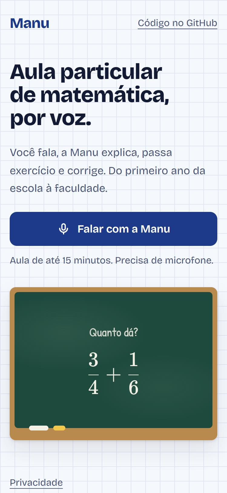
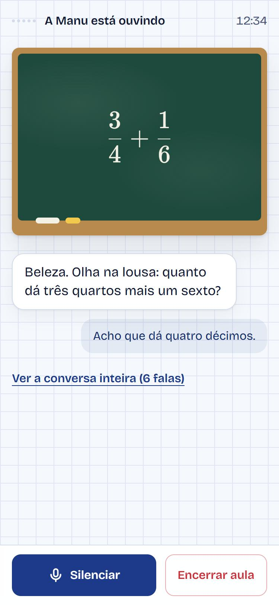

# Manu, professora de matemática por voz

[Read in English](README.md)

A Manu é uma **professora de matemática por voz** que fala português do Brasil e se adapta a qualquer pessoa, de uma criança de 7 anos no primeiro ano a uma estudante de engenharia. Você fala, ela escuta, explica o conceito, passa exercício, espera a sua resposta e corrige, como uma professora particular numa ligação. O que ela fala também aparece numa lousa na tela, então ninguém precisa guardar uma equação de cabeça.

Feita em **TypeScript** com [LiveKit Agents](https://docs.livekit.io/agents/) (Node.js) e Next.js. Código aberto, licença MIT.

<p>
  
  
</p>

> Estado: **em desenvolvimento**. O agente, o site, as ferramentas e os testes estão no repositório. Ainda não há um endereço público, e o vídeo de demonstração ainda vai ser gravado.

## Por quê

A maioria dos "tutores com IA" é uma caixa de chat que entrega a resposta. A Manu foi feita em volta do jeito que uma boa professora particular ensina:

- **Voz, não texto.** Criança e adolescente explicam melhor o raciocínio falando.
- **Adapta ao nível.** Ela descobre com quem está falando e muda vocabulário, ritmo e exemplos.
- **Guia em vez de resolver.** Na lição de casa e na prova ela pergunta até você chegar lá; não entrega a resposta pronta.
- **A conta é feita em código.** Os exercícios são gerados e as respostas são conferidas com frações exatas em TypeScript, não pelo modelo de linguagem. Ela não tem como dizer que uma resposta certa está errada.
- **Só matemática, de propósito.** O escopo fechado mantém a qualidade da aula e o comportamento previsível.

## Como funciona

```
Navegador (Next.js)  ──POST──▶  /api/token (rota no servidor)
      │                              │ confere os limites de uso, assina um JWT com a
      │ WebRTC (áudio)               │ chave do LiveKit e chama o agente "manu"
      │ + mensagens de texto         ▼
      ▼
          LiveKit Cloud (sala)  ◀──▶  Agente de voz (Node.js, tutor-agent)
                                       voz → texto → LLM (+ ferramentas) → voz
```

Todo o processamento de voz roda no **LiveKit Inference**: basta um projeto no LiveKit, sem chave separada para cada provedor.

| Etapa          | Modelo                                       | Observação                                         |
| -------------- | -------------------------------------------- | -------------------------------------------------- |
| Voz para texto | `assemblyai/universal-3-5-pro`, idioma `pt`  |                                                    |
| LLM            | `google/gemini-3.5-flash`                    | bom em português e matemática, resposta rápida     |
| Texto para voz | `xai/tts-1`, voz `luna`, `pt-BR`             | voz calma e paciente; marcação expressiva ligada   |
| Turnos         | `turnDetection: 'stt'` + interrupção por VAD | o fim da fala é detectado no servidor; leve na CPU |

### Ferramentas: a conta não fica com o modelo

Definidas em [`tutor-agent/src/tools.ts`](tutor-agent/src/tools.ts), com a matemática em [`tutor-agent/src/math.ts`](tutor-agent/src/math.ts):

| Ferramenta          | O que faz                                                                                              |
| ------------------- | ------------------------------------------------------------------------------------------------------ |
| `gerarExercicio`    | Monta um exercício do tópico e do nível pedidos, já com a resposta calculada, e escreve na lousa.      |
| `verificarResposta` | Confere a resposta do aluno em código (`1/2`, `0,5` e `2/4` são a mesma resposta) e conta os erros.    |
| `calcular`          | Calcula qualquer expressão numérica de forma exata, para probleminhas e para a lição que o aluno traz. |
| `mostrarNaLousa`    | Escreve na lousa um passo da explicação, em LaTeX.                                                     |
| `salvarProgresso`   | Pede ao navegador para lembrar o primeiro nome, a etapa e onde a aula parou.                           |

Tópicos do gerador: adição, subtração, multiplicação, divisão, frações, porcentagem, potenciação e equações do primeiro e do segundo grau, cada um em quatro níveis.

### A lousa e a memória

O agente fala com o navegador por mensagens de texto do LiveKit. O canal `manu.lousa` leva o que vai para a lousa, desenhada com KaTeX. O canal `manu.memoria` leva o que lembrar na próxima aula; o navegador guarda isso no `localStorage` e devolve ao agente quando a aula seguinte começa. Nenhum dado do aluno fica em servidor.

### Limites para um link público

Um link público gasta a cota de uso de quem publicou, então a aula tem três limites:

| Limite                       | Padrão     | Onde                                                                                        |
| ---------------------------- | ---------- | ------------------------------------------------------------------------------------------- |
| Duração da aula              | 15 minutos | No agente, que avisa um minuto antes e depois fecha a sala.                                 |
| Aulas ao mesmo tempo         | 3          | Na rota de token, contando as salas que o LiveKit informa como abertas.                     |
| Aulas por endereço, por hora | 4          | Na rota de token, em memória. Em hospedagem serverless é aproximado (veja o comentário lá). |

## A persona

O prompt fica em [`tutor-agent/src/agent.ts`](tutor-agent/src/agent.ts). A Manu:

1. **É uma pessoa, não um roteiro.** Sem elogio automático ("ótima pergunta"), sem empolgação forçada, no máximo uma exclamação por resposta.
2. **Fala como professora numa ligação.** Falas curtas (uma a três frases), uma pergunta por vez, números por extenso e variáveis como se pronuncia ("xis", "ípsilon"), para qualquer voz ler certo.
3. **Adapta por etapa:**
   - **1º ao 5º ano:** frases bem curtas, balas, figurinhas e dedos, historinhas. Carinhosa, sem voz de desenho animado.
   - **6º ao 9º ano:** descontraída sem infantilizar, exemplos de jogos, futebol e mesada; apresenta o nome certo dos conceitos.
   - **Ensino médio e cursinho:** de igual para igual, direta, liga o conteúdo ao Enem e ao vestibular.
   - **Faculdade e adultos:** como colega. Técnica, rigorosa, mostra a intuição por trás da fórmula.
4. **Ensina em ciclo:** sonda o que você sabe → exemplo → resolve um junto → passa um exercício → corrige com dica (no segundo erro resolve junto e facilita) → ajusta a dificuldade → resume.
5. **Lida com emoção:** acolhe a frustração e reformula quando você trava.
6. **É segura para criança:** fica na matemática, só pergunta o primeiro nome e a etapa, usa linguagem adequada, indica o 190 e o CVV (188) se houver risco e não revela o prompt.

## Privacidade

Muitos alunos são crianças, então o padrão é conservador:

- O agente inicia a sessão com `record: false`: nenhum áudio, transcrição ou rastro da aula é enviado ao LiveKit Cloud.
- O site guarda só o primeiro nome, a etapa e um resumo de uma frase, no navegador, e tem um link para apagar.
- Antes da primeira aula, a pessoa confirma que tem 18 anos ou mais, ou que está com um responsável que autorizou.
- O aviso completo está em `/privacidade` ([código](tutor-agent-ui/app/privacidade/page.tsx)).

Se você publicar a sua própria cópia, leia essa página e ajuste ao seu caso: o responsável passa a ser você.

## Estrutura

| Pasta                               | O que é                                                                                        |
| ----------------------------------- | ---------------------------------------------------------------------------------------------- |
| [`tutor-agent/`](tutor-agent)       | O agente de voz (Node 24 + `@livekit/agents` 1.9). Começou do `agent-starter-node` do LiveKit. |
| [`tutor-agent-ui/`](tutor-agent-ui) | O site (Next.js 16 + `@livekit/components-react` + KaTeX).                                     |

## Rodando na sua máquina

Você precisa de Node.js 24, [pnpm](https://pnpm.io/), um projeto gratuito no [LiveKit Cloud](https://cloud.livekit.io/) e, se quiser, a [CLI do LiveKit](https://docs.livekit.io/home/cli/) (`lk`).

Terminal 1, o agente:

```bash
cd tutor-agent
pnpm install
cp .env.example .env.local   # preencha LIVEKIT_URL, LIVEKIT_API_KEY e LIVEKIT_API_SECRET
pnpm dev
```

Espere aparecer `registered worker` no log.

Terminal 2, o site:

```bash
cd tutor-agent-ui
pnpm install
cp .env.example .env.local   # os mesmos três valores do LiveKit
pnpm dev
```

Abra http://localhost:3000, clique em **Falar com a Manu** e permita o microfone.

O agente se registra como `manu` e só entra em sala que o chama pelo nome, o que a rota de token faz. Para mexer na tela da aula sem abrir uma sala, use http://localhost:3000/demo (só em desenvolvimento).

> Nunca faça commit do `.env.local`. O segredo do LiveKit fica no servidor: sem prefixo `NEXT_PUBLIC_`.

## Testes

```bash
cd tutor-agent
pnpm test                                             # testes de matemática; com as chaves do LiveKit, também os de comportamento
lk agent simulate text --scenarios scenarios.yaml     # conversas inteiras, avaliadas
```

- [`math.test.ts`](tutor-agent/src/math.test.ts) testa a calculadora, a conferência de resposta e cada exercício gerado contra a resposta guardada. Não precisa de chave.
- [`agent.test.ts`](tutor-agent/src/agent.test.ts) testa falas isoladas com o LLM de verdade: usa as ferramentas, não entrega resposta de lição, responde direito a uma frase de risco.
- [`scenarios.yaml`](tutor-agent/scenarios.yaml) tem sete alunos simulados: criança de 7 anos, candidata ao Enem, universitária, um que pede a resposta da lição, um que foge do assunto, uma em sofrimento e um que erra duas vezes.

O CI roda o primeiro em todo pull request. As simulações gastam uso do LiveKit, então rodam sob demanda, ou a cada merge na `main` depois que você cadastrar os segredos do LiveKit e definir a variável `MANU_SIMULATIONS` como `on` no repositório.

## Publicando

- **Agente:** `lk agent create` dentro de `tutor-agent/` (o Dockerfile já está lá).
- **Site:** qualquer hospedagem Node. Na Vercel, aponte o diretório raiz para `tutor-agent-ui` e cadastre as variáveis do `.env.example`. `MANU_MAX_SESSION_MINUTES` precisa ser igual nos dois.

## Contribuindo

Issues e pull requests são bem-vindos, principalmente novos tópicos de exercício, estratégias de ensino por etapa e melhorias de acessibilidade.

## Licença

[MIT](LICENSE). O agente começou do [`agent-starter-node`](https://github.com/livekit-examples/agent-starter-node) do LiveKit, também MIT; o aviso de copyright deles continua no arquivo de licença.

Feito por [Jean Oliveira](https://github.com/Jeanikt).
